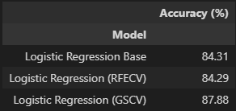
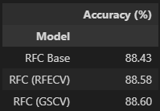

# machine-learning-challenge

## Background
Over a period of nine years in deep space, the NASA Kepler space telescope has been out on a planet-hunting mission to discover hidden planets outside of our solar system.
To help process this data, you will create machine learning models capable of classifying candidate exoplanets from the raw dataset.

## Models
Two models were developed for this exercise. First was a logistic regression model and the second was using a random forest classifier.

In both models, it was initially assumed that all 40 variables may be used to help determine the classification of the exoplanet.

From there, we further tuned and developed the model through the use of sklearn's RFECV function (recursive feature elimination and cross-validated selection) to determine the most important variables within the data. The reason for applying this was to attempt to remove any bias / skewness which may have been applied to the model from insignificant variables.

Lastly, we applied Grid Search CV to further tune the model and in both instances, were able to develop models which had greater accuracy than both the base and RFECV variations.

Overall, the Random Forest Classifier models returned better accuracy in predicting exoplanet classifications than the logistic regression models. Of which, all three models were relatively similar, though the Grid Search CV tuned model returned a marginally higher accuracy.

## Conclusion
Moving forward, it may be worth exploring other machine learning models to determine if there is one which provides even better accuracy than the RFC model. That being said, the RFC model does already provide for a very good prediction of the classification in the variables available in the dataset.